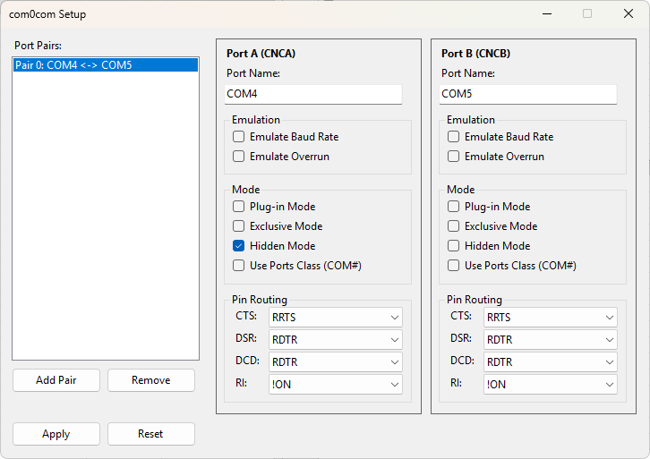

# com0com User Guide

Last updated: 2026-08-29

## What com0com Does

com0com creates virtual serial port pairs on Windows. Each pair is a null-modem
connection: data written to one port appears as input on the other, and vice versa.
There is no physical cable. Applications see the ports as real COM ports.

A typical use: two programs that need to talk over a serial connection, running on
the same machine. Instead of two physical serial ports and a null-modem cable,
you install a com0com port pair.

## Quick Start: The Bare Minimum

After installation, you need one port pair. From an administrator command prompt:

```
cd "C:\Program Files\com0com"
setupc --silent install 0 PortName=COM# PortName=COM#
```

This creates pair 0. Windows assigns the next two free COM port numbers (for example
COM4 and COM5). Both ports appear in Device Manager under Ports (COM & LPT).

Open `COM4` in one application and `COM5` in another. Data flows between them.

To remove the pair:

```
setupc --silent remove 0
```

To see what pairs exist:

```
setupc list
```

## What CNCA and CNCB Mean

CNCA and CNCB are internal identifiers, not visible COM port names. The naming
convention is:

| Identifier | Meaning |
|---|---|
| `CNCA0` | Side A of pair 0 |
| `CNCB0` | Side B of pair 0 |
| `CNCA1` | Side A of pair 1 (if you create a second pair) |
| `CNCB1` | Side B of pair 1 |

These identifiers appear as port names ONLY if you never set `PortName=`. As soon
as you set `PortName=COM#`, the port appears as a standard COM port. The CNCA/CNCB
identifier remains as the internal key used by `setupc change` commands.

**To rename an existing port to a COM number:**

```
setupc change CNCA0 PortName=COM8
setupc change CNCB0 PortName=COM9
```

Use `COM#` (with the hash) to let Windows pick the next free number automatically.

## The Setup GUI (setupg.exe)

Launch `setupg.exe` from the install directory. The window shows:



### Port Name Field

Shows the current COM port name and sends its contents to `setupc change` when
you click Apply. Enter `COM#` for automatic COM port assignment by Windows.
Enter `COM8` for a specific number. Enter `-` to reset to the CNCAx/CNCBx
identifier.

### Use Ports Class Checkbox

This checkbox shows whether the port is set to `COM#` automatic assignment.
Ports with `COM#` are registered under the Windows Ports class, which makes
them appear as standard COM ports in Device Manager and in application port
lists. Ports with CNCAx/CNCBx names use the CNCPorts class and are opened as
`\\.\CNCA0` rather than `\\.\COM4`.

To register a port under the Ports class, type `COM#` into the name field and
click Apply. The checkbox reflects that state.

### Hidden Mode Checkbox

When checked, the port does not appear in Device Manager. Applications can still
open it if they know the name. This is useful when one side of the pair is used
by a service or background process that does not need user visibility.

HiddenMode is **off by default for both ports**. The driver initializes every port
identically. There is no built-in convention of hiding one side. Enable it on
either or both ports as needed.

### Baud Rate Emulation

By default, data transfers instantly between ports regardless of baud rate
settings. When **Emulate baud rate** is checked, the driver throttles data
to the actual bit rate. At 9600 baud with 8-N-1 framing (10 bits per byte),
this means approximately 960 bytes per second.

Enable this when testing applications that depend on timing, for example,
protocols with timeouts or baud-rate-dependent flow control. Leave it off for
maximum throughput.

### Apply and Reset Buttons

**Apply** writes all changes made in the GUI to the driver. Until you click Apply,
your edits exist only in the GUI. After Apply, the driver is notified and the
changes take effect immediately (no reboot needed for most parameters). The
status line shows "Nothing to apply." when there are no pending changes and
"Changes applied." after a successful apply.

**Reset** discards all un-applied changes by reloading the current state from
the driver. The status line shows "Changes discarded." when there were pending
changes, and "Already up to date." when the GUI already matches the driver.

Typical workflow: make changes → click Apply to commit them → verify the changes
work → if something is wrong, make more changes → Apply again. Use Reset when you
change your mind before committing.

## All Configuration Parameters

Each port in a pair has 15 configurable parameters. They are set via the GUI
(on the port's panel) or via `setupc change <port> <param>=<value>`.

### Port Identity

| Parameter | GUI control | What it does | Default |
|---|---|---|---|
| `PortName=` | Port name textbox | The COM port name visible to applications. Use `COM#` for auto-assignment. | `CNCA0`/`CNCB0` etc. |
| `RealPortName=` | (hidden, set by Windows) | When `PortName=COM#`, this holds the actual COM number assigned. | (empty) |

### Port Visibility

| Parameter | GUI control | What it does | Default |
|---|---|---|---|
| `HiddenMode=` | Hidden mode checkbox | Port permanently hidden from enumerators. Apps can still open by name. | `no` |
| `ExclusiveMode=` | (advanced, no GUI) | Port hidden while open by an application. | `no` |
| `PlugInMode=` | (advanced, no GUI) | Port hidden until its paired port is opened. Appears on-demand. | `no` |

**HiddenMode vs ExclusiveMode vs PlugInMode**: All three hide the port from
enumeration but differ in WHEN:
- HiddenMode: always hidden, even when unused
- ExclusiveMode: hidden only while an application has the port open
- PlugInMode: hidden until the OTHER port in the pair is opened, then appears

### Emulation and Flow Control

| Parameter | GUI control | What it does | Default |
|---|---|---|---|
| `EmuBR=` | Emulate baud rate checkbox | Throttle data to actual baud rate timing. | `no` |
| `EmuOverrun=` | (advanced, no GUI) | When buffer is full: discard data (like real UART) instead of blocking sender. | `no` |
| `EmuNoise=` | (advanced, no GUI) | Probability 0 to 0.99999999 of corrupting each character frame. Simulates line noise. | `0` |
| `AllDataBits=` | (advanced, no GUI) | Pass all 8 data bits regardless of the port's data bits setting (5/6/7/8). | `no` |

**EmuOverrun warning**: The default `no` means a sender blocks when the receiver's
buffer is full. If the receiver application stalls, the sender hangs. Set to `yes`
if you need UDP-like discard behavior.

### Timing

| Parameter | GUI control | What it does | Default |
|---|---|---|---|
| `AddRTTO=` | (advanced, no GUI) | Milliseconds added to Read Total Timeout. Use for apps that need network-like latency. | `0` |
| `AddRITO=` | (advanced, no GUI) | Milliseconds added to Read Interval Timeout. | `0` |

### Pin Routing (Modem Control Signals)

Each of the four modem input pins can be wired to a signal source. The pin
routing dropdowns in the GUI show the current wiring for CTS, DSR, DCD, and RI.

**Available sources:**

| Source | Meaning |
|---|---|
| `rrts` | Remote RTS: the paired port's RTS output |
| `rdtr` | Remote DTR: the paired port's DTR output |
| `rout1` | Remote OUT1 |
| `rout2` | Remote OUT2 |
| `ropen` | Remote port open state |
| `lrts` | Local RTS: this port's own RTS output (loopback) |
| `ldtr` | Local DTR: this port's own DTR output (loopback) |
| `lout1` | Local OUT1 |
| `lout2` | Local OUT2 |
| `lopen` | Local port open state |
| `on` | Always asserted (logical 1) |

Prefix any source with `!` to invert it. For example, `!on` means always
deasserted (logical 0).

**Default pin wiring for a port pair:**

| Pin | Port A default | Port B default | Effect |
|---|---|---|---|
| CTS | `rrts` (remote RTS) | `rrts` (remote RTS) | Each side sees the other's RTS on its CTS |
| DSR | `rdtr` (remote DTR) | `rdtr` (remote DTR) | Each side sees the other's DTR on its DSR |
| DCD | `rdtr` (remote DTR) | `rdtr` (remote DTR) | Each side sees the other's DTR on its DCD |
| RI | `!on` (always off) | `!on` (always off) | Ring indicator never asserts |

These defaults match the behavior of a physical null-modem cable with full
handshaking. The most common change is wiring RI to something useful, such as
`lopen` for a port-active indicator.

## Using setupc from the Command Line

### PowerShell or CMD (administrator required)

List all pairs:
```
setupc list
```

Create pair 0 with auto-assigned COM ports:
```
setupc --silent install 0 PortName=COM# PortName=COM#
```

Create pair 1 with specific names:
```
setupc --silent install 1 PortName=COM10 PortName=COM11
```

Create pair 2 with defaults (CNCA2/CNCB2 names):
```
setupc --silent install 2 - -
```

`-` means "use defaults for this port." The first `-` is for port A, the second for port B.

Remove pair 0:
```
setupc remove 0
```

Rename an existing port:
```
setupc change CNCA0 PortName=COM8
setupc change CNCB0 PortName=COM9
```

Change baud rate emulation on one port:
```
setupc change CNCA0 EmuBR=yes
```

Change pin routing:
```
setupc change CNCA0 cts=lrts dsr=ldtr
```

Disable (deactivate) all pairs without removing them:
```
setupc disable all
```

Enable all pairs:
```
setupc enable all
```

Reload the driver after manual registry changes:
```
setupc reload
```

### Important `-` and `*` conventions

- `-` as a parameter value **deletes** the registry entry and reverts to the driver default
- `*` as a parameter value **preserves** the current value unchanged
- `-` as a port name resets to the CNCAx/CNCBx identifier

### Global options

| Option | Effect |
|---|---|
| `--silent` | Suppress message boxes and confirmation prompts |
| `--no-update` | Skip driver reactivation. Use for batch operations, run once at the end. |
| `--wait` | Wait for driver to finish processing before returning |
| `--detail-prms` | Show all 15 parameters per port in list output |
| `--output <file>` | Append output to a file |

## Example Workflows

### Workflow 1: Simple Loopback for Application Testing

Goal: Two instances of a terminal program talking to each other.

1. Install driver if not already installed:
   ```
   setupc --silent preinstall
   setupc --silent update
   ```

2. Create a port pair with COM port numbers:
   ```
   setupc --silent install 0 PortName=COM# PortName=COM#
   ```

3. Note the assigned ports (shown in the output, or run `setupc list`).

4. Open COM4 in PuTTY (or your terminal) at 9600-8-N-1.
   Open COM5 in another PuTTY instance at the same settings.

5. Type in one window. Characters appear in the other.

6. Remove when done:
   ```
   setupc remove 0
   ```

### Workflow 2: Baud-Rate-Dependent Protocol Testing

Goal: Test a protocol that has a 100ms timeout at 9600 baud, to verify it
handles timing correctly.

1. Install pair:
   ```
   setupc --silent install 0 PortName=COM10 PortName=COM11 EmuBR=yes EmuBR=yes
   ```

2. Both ports now honor baud rate timing. At 9600-8-N-1, a 100-byte message
   takes approximately 104 milliseconds to transfer.

3. Your test application on COM10 sends a message. The application on COM11
   must respond within the protocol's timeout window. The emulated baud rate
   ensures realistic timing.

4. Without `EmuBR=yes`, the 100-byte message transfers instantly (microseconds),
   and your timeout test would always pass, hiding real-world timing bugs.

### Workflow 3: Hidden Background Service Port

Goal: A Windows service uses one port, a GUI application uses the other.
Only the GUI port should be visible to users.

1. Create pair with port B hidden:
   ```
   setupc --silent install 0 PortName=COM4 PortName=COM5 HiddenMode=yes
   ```
   Here, the second `HiddenMode=yes` applies to port B (CNCB0).

2. COM4 appears in Device Manager. COM5 does not.

3. The service opens `\\.\COM5` (it knows the name). The GUI opens COM4.

4. Users see only COM4. COM5 is invisible but fully functional.

### Workflow 4: Renaming After Installation

Goal: The installer created CNCA0/CNCB0. You want COM4/COM5 instead.

1. Check current state:
   ```
   setupc list --detail-prms
   ```

2. Rename both ports:
   ```
   setupc change CNCA0 PortName=COM#
   setupc change CNCB0 PortName=COM#
   ```

3. Windows assigns COM port numbers. Check with `setupc list` to see which
   numbers were assigned.

4. If you need specific numbers, use `PortName=COM4` instead of `COM#`.

### Workflow 5: Custom Pin Routing for Hardware Handshake Testing

Goal: Wire CTS to local RTS (loopback) so the port's own RTS comes back on CTS.

1. Change pin wiring:
   ```
   setupc change CNCA0 cts=lrts
   ```

2. When an application on CNCA0 asserts RTS, it immediately sees CTS assert.
   This simulates a device that always grants flow control.

3. Other common custom wirings:
   - `dcd=lopen`: DCD asserts when the port is opened (carrier detect from
     local open state)
   - `ri=lopen`: RI (ring indicator) pulses when the port is opened
   - `cts=on`: CTS always asserted (no hardware flow control)

## The "Install Driver" Warning

When you create a new port pair, Windows may show a driver installation
confirmation dialog. This is normal. com0com is a kernel-mode driver, and
Windows validates driver signatures. With test signing enabled, Windows
still prompts for confirmation on first installation.

The dialog appears because each new port pair creates new device instances,
and Windows asks whether to trust the driver for these new instances.

To suppress this during automated setups, use `setupc --silent` which
runs without UI and accepts the prompts programmatically.

## Registry Layout

All port configuration is stored at:
```
HKLM\SYSTEM\CurrentControlSet\Services\com0com\Parameters\<port identifier>\
```

For example, port CNCA0's parameters are at:
```
HKLM\SYSTEM\CurrentControlSet\Services\com0com\Parameters\CNCA0\
```

Each of the 15 parameters has a REG_SZ value. Values are stored exactly
as entered, except PortName, which is always uppercased.

The driver reads these at startup and when a reload command is issued.
Changes take effect on the next port open or after `setupc reload`.

## Common Issues

**Q: Applications cannot find the COM ports.**
Make sure "Use Ports Class" is checked in the GUI, or you used `PortName=COM#`
when creating the pair. If the ports are registered under CNCPorts class
instead of Ports class, enumeration APIs (like `SerialPort.GetPortNames()`
in .NET) will not see them.

**Q: One application hangs when sending data.**
The default `EmuOverrun=no` means the sender blocks when the receiver's
buffer is full. Make sure the receiving application is reading data.
If the receiver intentionally does not read, set `EmuOverrun=yes` to
discard overflow data instead of blocking.

**Q: Port names are red in the GUI.**
The name conflicts with an existing COM port (physical or virtual).
Choose a different number or let Windows auto-assign with `COM#`.

**Q: Changes in the GUI do not take effect.**
Click Apply. Until you click Apply, changes are only in the GUI.
setupc change commands take effect immediately (the driver is notified).

**Q: setupc says "The system cannot find the file specified".**
The driver is not installed or not running. Run:
```
setupc preinstall
setupc update
```
Or check Device Manager under "com0com - serial port emulators".
